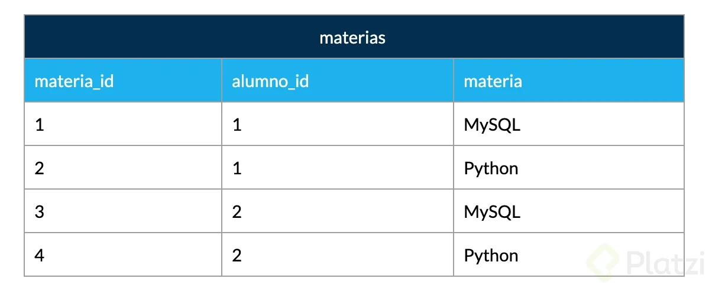
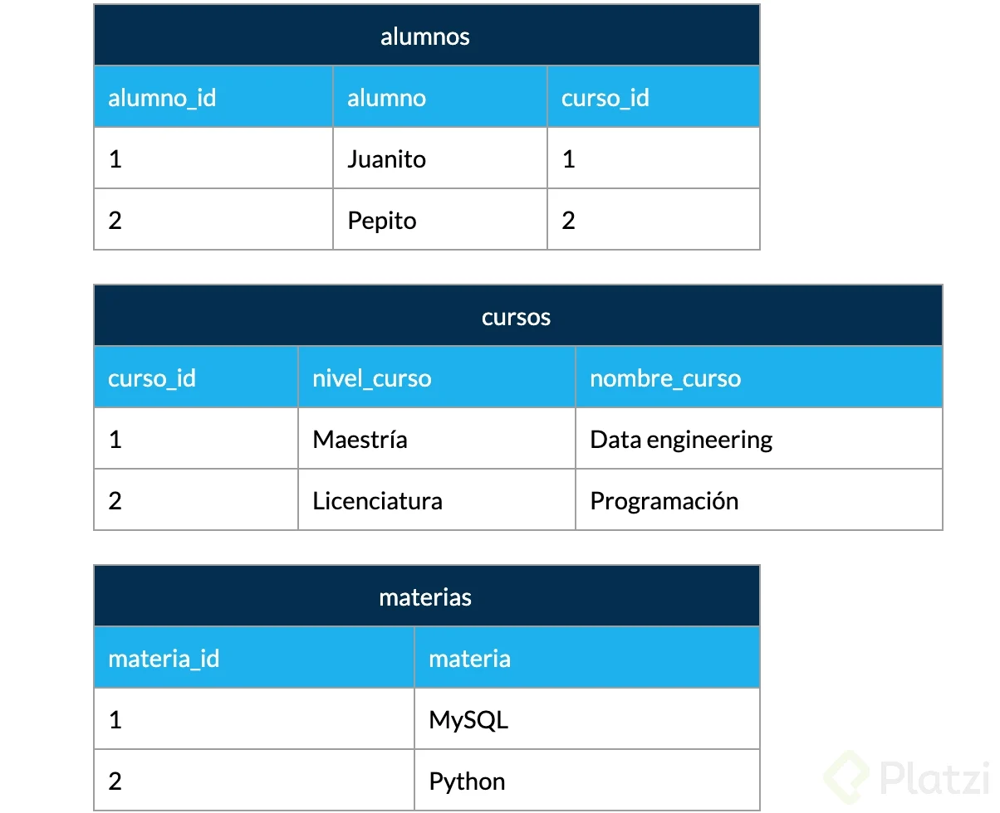
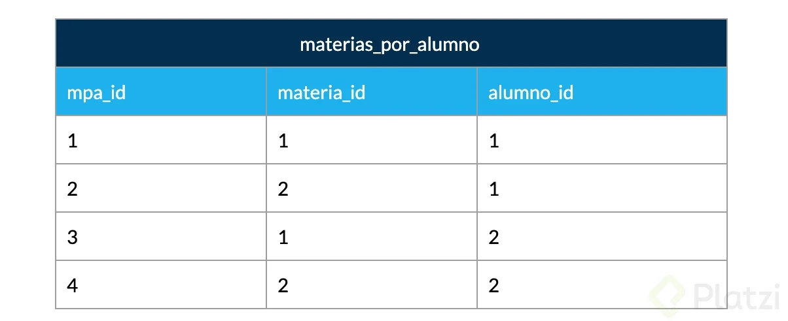

<! --HEADINGS-->

# 
# Curso de Fundamentos de Bases de Datos  

## Historia de la persistencia de la información :
Para poder llegar a las bases de datos actuales la humanidad
ha tenido que pasar por multiples formas para guardar la información.

- Estructura de los sumerios, tallados en piedra y arcilla
- Pergamino y el papiro
- Papel creado por los chinos
- Microfilm
- Medios digitales (DVD, CD, disco duro, solido)
- Nube

## Las base de datos actuales:
Las bases de datos entran en la trasicioón de los medios digitales y la nube

### Las bases de datos se dividen en dos grandes grupos :
#### Relacionales
  - SQL server
  - MariaDB
  - Oracle
  - PostgreSQL
  - Mysql

#### No Relacionales: 
  - Cassandra
  - Elasticsearch
  - Neo4j
  - MongoDB

### Servicios :
- **Auto administrados**: Son las bases de datos que instalamos en nuestro pc, nos encargamos de la parte de mantenimiento, updates, etc.

- **Administrados**: No los llevamos nosotros, los ofrecen las nubes como Amazon, Microsoft Azure, Google Cloud

# Historia de las bases de datos relacionales - RDB

Las bases de datos surgen por la necesidad de conservar la información más allá en la memoria ram.

En el modelo de Von Neumann  solo se contempla la de una memoria ram y procesamiento de datos pero  no de guardar información o de datos que se tenian.

Anteriormente se usaban bases de datos basadas en archivos, el cuál era texto plano fácil de guardar, pero difícil de extraer, por esto se inventaron las bases de datos relacionales. En 1990 Codd se preocupó porque los sistemas de gestión de bases de datos (SGBD) que decían ser relacionales, no lo eran. 

El Dr. Edgar Frank Codd (19 de agosto de 1923 - 18 de abril de 2003) fue un informático que mientras trabajaba para IBM inventó el modelo relacional para la gestión de bases de datos (base teórica para las bases de datos relacionales). Codd propuso trece reglas (numeradas del cero al doce) y dijo que si un Sistema de gestión de bases de datos cumple con estas reglas, puede llamarse Sistema de gestión de bases de datos relacionales. 

En la práctica es difícil cumplir las 12 pero, un SGBD es más relacional cuantas más reglas cumpla

**Las Reglas y mandamientos de Edgar Frank Ted Codd**

- **Regla 0**: Regla de fundación.
* a. Cualquier sistema que se proclame como relacional, debe ser capaz de gestionar sus bases de datos enteramente mediante sus capacidades relacionales.

- **Regla 1**: Regla de la información.
* a. Todos los datos deben estar almacenados en las tablas
* b. Esas tablas deben cumplir las premisas del modelo relacional
* c. No puede haber información a la que accedemos por otra vía

- **Regla 2**: Regla del acceso garantizado.
* a. Cualquier dato es accesible sabiendo la clave de su fila y el nombre de su columna o atributo
* b. Si a un dato no podemos acceder de esta forma, no estamos usando un modelo relacional

- **Regla 3**: Regla del tratamiento sistemático de valores nulos.
* a. Esos valores pueden dar significado a la columna que los contiene
* b. El SGBD debe tener la capacidad de manejar valores nulos
* c. El SGBD reconocerá este valor diferenciándolo de cualquier otro
* d. El SGBD deberá aplicársele la lógica apropiada
* e. Es un valor independiente del tipo de datos de la columna

- **Regla 4**: Catálogo dinámico en línea basado en el modelo relacional.
* a. El catálogo en línea es el diccionario de datos
* b. El diccionario de datos se debe de poder consultar usando las mismas técnicas que para los datos
* c. Los metadatos, por tanto, se organizan también en tablas relacionales
* d. Si SELECT es una instrucción que consulta datos, también será la que consulta los metadatos

- **Regla 5**: Regla comprensiva del sublenguaje de los datos completo.
* a. Al menos tiene que existir un lenguaje capaz de hacer todas las funciones del SGBD
* b. No puede haber funciones fuera de ese lenguaje
* c. Puede haber otros lenguajes en el SGBD para hacer ciertas tareas
* d. Pero esas tareas también se deben poder hacer con el “lenguaje completo”

- **Regla 6**: Regla de actualización de vistas.
* a. Las vistas tienen que mostrar información actualizada
* b. No puede haber diferencias entre los datos de las vistas y los datos de las tablas base

- **Regla 7**: Alto nivel de inserción, actualización, y cancelación.
* a. La idea es que el lenguaje que maneja la base de datos sea muy humano
* b. Eso implica que las operaciones del lenguaje de manipulación de los datos (DML) trabajen con conjuntos de filas a la vez
* c. Para modificar, eliminar o añadir datos, no hará falta programar de la forma en la que lo hacen los lenguajes de tercera generación como C o Java

- **Regla 8**: Independencia física de los datos.
* a. Cambios en la física de la BD no afecta a las aplicaciones ni a los esquemas lógicos
* b. El acceso a las tablas (elemento lógico) no cambia porque la física de la base de datos cambie

- **Regla 9**: Independencias lógicas de los datos.
* a. Cambios en el esquema lógico (tablas) de la BD no afectan al resto de esquemas
* b. Si cambiamos nombres de tabla, o de columna o modificamos información de las filas, las aplicaciones (esquema externo) no se ven afectadas
* c. Es más difícil de conseguir

- **Regla 10**: Independencia de la integridad.
* a. Las reglas de integridad (restricciones) deben de ser gestionadas y almacenadas por el SGBD

- **Regla 11**: Independencia de la distribución.
* a. Que la base de datos se almacene o gestione de forma distribuida en varios servidores, no afecta al uso de esta ni a la programación de las aplicaciones de usuario
* b. El esquema lógico es el mismo independientemente de si la BD es distribuida o no

- **Regla 12**: La regla de la no subversión.
* a. La base de datos no permitirá que exista un lenguaje o forma de acceso, que permita saltarse las reglas anteriores

Edgard Codd invento el Álgebra Relacionl: El álgebra relacional es un lenguaje de consulta procedimental, que toma instancias de relaciones como entrada y produce instancias de relaciones como salida. Utiliza operadores para realizar consultas. Un operador puede ser unario o binario . Aceptan relaciones como su entrada y producen relaciones como su salida. El álgebra relacional se realiza recursivamente sobre una relación y los resultados intermedios también se consideran relaciones.

### Las operaciones fundamentales del álgebra relacional son las siguientes:
- Seleccione
- Proyecto
- Unión
- Establecer diferente
- producto cartesiano
- Rebautizar

[Para más información.](https://www.tutorialspoint.com/dbms/relational_algebra.htm)

#  Qué son entidades y atributos - *{Clase 4}*
    Vamos a ver los principales objetos que se van a manejar como parte de día a día en la construcción de base de datos.

En bases de datos, una entidad es la representación de un objeto o concepto del mundo real que se describe en una base de datos. Las entidades se describen en la estructura de la base de datos empleando un modelo de datos.

## 1. **ENTIDAD** 
    Por convención las entidades se ponen en plurar porque una entidad  representa un grupo de estos objeto.
* ### **¿Qué es una entidad?**
  Una entidad es algo similar a un objeto (programación orientada a objetos) y **representa algo en el mundo real**, incluso algo abstracto. Tienen atributos que son las cosas que los hacen ser una entidad y por convención se ponen en plural.

  * ### ***Ejemplo de entidad en bases de datos***
    En la imagen puedes observar como ejemplo que la enidad Laptops posee diferentes atributos como coloR, pantalla, año, modelo, etc.

    

    

    En el cuadro anterior podemos observar que el dato **No de serie**  es lo único que diferencia a dos entidades que tienen los mismos datos, esto se debe a que en base de datos no se puede permitir endidaes repetidas. Por lo tanto, **se crean atributos denominados atributos llave.**

* ## ¿Qué es un atributo?
      Son las características o propiedades que describen a la entidad (se encierra en un óvalo). 
  Los atributos se componen de:

  * **Los atributos compuestos:** son aquellos que tienen atributos ellos  mismos.

  * **Los atributos llave:** son aquellos que identifican a la entidad y no pueden ser repetidos, entre ellos existen:
    * Naturales: son inherentes al objeto como el número de serie
    * Clave artificial: no es inherente al objeto y se asigna de manera arbitraria.
## Tipos de entidades
   

   Ejemplares es una entidad debil porque no puedes tener un ejemplar de  un libro que no tienes.

* **Entidades fuertes:** son entidades que pueden sobrevivir por sí solas.

* **Entidades débiles:**
  no pueden existir sin una entidad fuerte y se representan con un cuadrado con doble línea.

  * **Identidades débiles por *IDENTIDAD*:** no se         diferencian entre sí más que por la clave de su identidad fuerte.
  
    Ejemplo:
    
  * **Identidades débiles por *EXISTENCIA***: se les    asigna una clave propia.

    
# **RELACIÓN**
   Las ***relaciones*** son la manerá en que comenzamos a ligar nuestras diferentes **entidades** u objeto.

  Las relaciones se representan con un rombo. Las relaciones por convención se definen a través de verbos.

   *  Ejemplo:    
    
    
     Discos duros no era un atributo era un atributo multivaluado, es decir, que una laptop puede tener más de un dico duro. Y por lo general un atributo multivaluado se convierte en una entidad separadas proque tienen una vida por si misma y porque se pueden relacionar de varias maneras con  en este caso laptops

  Para definir la relación de cuantos discos duros tiene una laptop se hacer referencia a la propiedad de las relaciones que se llama **cardinalidad**
  * **La Cardinalidades**
  es el número de veces que una entidad aparece asociada a otra entidad, entre la cardinaliadad se pueden encontrar diferentes tipos.
  * **N/M** Hace referencia a muchos
  * **0** Hace referencia a que es opcional pueden haber cero , una o varias personas.
  

    1. **Cardinalidad: 1 a 1**
     
    2. **Cardinalidad: 0 a 1**
     
    3. **Cardinalidad: 1 a N**
     
    4. **Cardinalidad: 0 a N**
     
    5. **Cardinalidad: N a N**
     

## DIAGRAMA ER/ENTIDAD RELACIÓN
  Un diagrama es como un mapa y nos ayuda a entender cuáles son las entidades con las que vamos a trabajar, cuáles son sus relaciones y qué papel van a jugar en las aplicaciones de la base de datos.

  Un diagrama entidad-relación, también conocido como modelo entidad relación o ERD, es un tipo de diagrama de flujo que ilustra cómo las "entidades", como personas, objetos o conceptos, se relacionan entre sí dentro de un sistema. Los diagramas ER se usan a menudo para diseñar o depurar bases de datos relacionales en los campos de ingeniería de software, sistemas de información empresarial, educación e investigación. También conocidos como los ERD o modelos ER, emplean un conjunto definido de símbolos, tales como rectángulos, diamantes, óvalos y líneas de conexión para representar la interconexión de entidades, relaciones y sus atributos. Son un reflejo de la estructura gramatical y emplean entidades como sustantivos y relaciones como verbos [...](https://www.lucidchart.com/pages/es/que-es-un-diagrama-entidad-relacion)

  [Para crear diagramas ER en línea link 1](https://online.visual-paradigm.com/app/diagrams/#diagram:proj=0&type=ERDiagram)

  [Para crear diagrama ER en línea link 2](https://app.diagrams.net)

* ## Cómo representar las entidades en bases de     datos
  Existen varios tipos de notaciones para los modelos entidad relacionamiento. Chen es uno de los más utilizados para diagramar lógicamente la base de datos. Aquí te mostramos un ejemplo.
  
* Veamos un ejemplo de un **Diagrama ER** de un Blog que se desarrollará en el transcurso del curso.
   

  

   
 
  De esta forma conectamos a las **Entidades** 
  **Posts** & **Usuarios** con sus respectivas **atributos**, ya solo faltan los **Comentarios** & **Categorías**.
* ### **Continuando con el ejercicio del Blog tenemos el siguiente de DIAGRAMA ER**
  

## **DIAGRAMA FISICO:** 
   Este diagrama se deriva del anterior y para llevarlo a la practica se debe ir más alla y darle detalle. 
   
   ¿Qué tipo de detalle?
   Un tipo de parametros que nos ayude a traducir lo que la base de datos va entender.

 * ### **Tipos de datos:** Estos tienen        propiedades  para garantizar menor consumo de memoria según se necesite el caso.

   
   * ### **Tipos de datos texto**

     * ### **Char(n):** Permite almacenar caracteres y cadenas de texto. Este tipo de dato reserva un espacio de memoria del número de caracteres que va a ser ocupado.
     * ### **VarChar(n):** Al igual que char, este reserva espacio en la memoria. Su diferencia radica en que este reserva un mínimo espacio de memoria, y a partir de esta va creciendo o encogiéndose, es eficiente cuando desconocés cual será el tamaño de tu cadena de texto (Su limite es de 255 caracteres).
     * ### **Text:** Sirve para guardar cadenas muy grandes por ejemplo 500 o 1000
   * ### **Tipos de datos númericos**
     * ### **Integer:** Número que no tiene punto decimal, se usa para declarar un tipo de dato entero que puede ser usado para hacer operaciones. Al usar este tipo de dato nuestra base de datos sabrá que estamos hablando de número y no solo de un simple carácter.
     * ### **Bigint:** Es un subtipo de integer, nos sirve para declarar números muy grandes.
     * ### **Smallint:** Subtipo de integer, nos para declarar números muy pequeños (99 o menos).
     * ### **Decimal (n, s) & Numeric (n, s):** Tiene dos parámetros (n y s, en este ejemplo). La primera entrada es para números enteros, y la segunda entrada es para números decimales.Nos sirve para hacer operaciones mas precisas.
   * ### **Tipos de fecha y hora:**
     * ### **Date:** Solo contiene la fecha (año, mes y día).
     * ### **Time:** Solo contiene la hora.
     * ### **Datetime:** Es una mezcla de los dos primeros, contiene fecha y hora.
     * ### **Timestamp:** Es el número de segundos que ha transcurrido desde que tu archivo fue creado. En otras palabras, podría decirse que es un medidor de tiempo.
  * ### **Los contraints o restricciones**
    
    Constraints (Restricciones)
  NOT NULL: Se asegura que la columna no tenga valores nulos
  
      * FOREIGN KEY O CLAVE FORANEA: Identifica de manera única una tupla en otra tabla

* ## **Diagrama Físico: normalización**
  La normalización en las bases de datos relacionales es uno de esos temas que, por un lado es sumamente importante y por el otro suena algo esotérico. Vamos a tratar de entender las formas normales (FN) de una manera simple para que puedas aplicarlas en tus proyectos profesionales. 

  La normalización como su nombre lo indica nos ayuda a dejar todo de una forma normal. Esto obedece a las 12 reglas de Codd y nos permiten separar componentes en la base de datos:
  * ### **Ejemplo normalicemos la siguiente tabla**
    

  * **Primera forma normal (1FN):** ***Atributos atómicos (Sin campos repetidos)***
  
  Formalmente, una tabla está en primera forma normal si:
    
    * Todos los atributos son atómicos. Un atributo es atómico si los elementos del dominio son simples e indivisibles.
    * No debe existir variación en el número de columnas.
    * Los campos no clave deben identificarse por la clave (dependencia funcional).
    * Debe existir una independencia del orden tanto de las filas como de las columnas; es decir, si los datos cambian de orden no deben cambiar sus significados.

    Se traduce básicamente a que si tenemos campos compuestos como por ejemplo “nombre_completo” que en realidad contiene varios datos distintos, en este caso podría ser “nombre”, “apellido_paterno”, “apellido_materno”, etc.

    También debemos asegurarnos que las columnas son las mismas para todos los registros, que no haya registros con columnas de más o de menos.

    Todos los campos que no se consideran clave deben depender de manera única por el o los campos que si son clave.

    Los campos deben ser tales que si reordenamos los registros o reordenamos las columnas, cada dato no pierda el significado.

  * **Segunda forma normal (2FN):** ***Cumple 1FN y cada campo de la tabla debe depender de una clave única.***
  

    Esta FN nos ayuda a diferenciar los datos en diversas entidades.
    Formalmente, una tabla está en segunda forma normal si:
     
    * Está en 1FN
    * Sí los atributos que no forman parte de ninguna clave dependen de forma completa de la clave principal. Es decir, que no existen dependencias parciales.
    * Todos los atributos que no son clave principal deben depender únicamente de la clave principal.

    Lo anterior quiere decir que sí tenemos datos que pertenecen a diversas entidades, cada entidad debe tener un campo clave separado. Por ejemplo:
    

    En la tabla anterior tenemos por lo menos dos entidades que debemos separar para que cada uno dependa de manera única de su campo llave o ID. En este caso las entidades son alumnos por un lado y materias por el otro. En el ejemplo anterior, quedaría de la siguiente manera:

    

  * **Tercera forma normal (3FN):** ***Cumple 1FN y 2FN y los campos que NO son clave, NO deben tener dependencias.***
  
   
    Esta FN nos ayuda a separar conceptualmente las entidades que no son dependientes.
    Formalmente, una tabla está en tercera forma normal si:
    
     * Se encuentra en 2FN
     * No existe ninguna dependencia funcional transitiva en los atributos que no son clave

    Esta FN se traduce en que aquellos datos que no pertenecen a la entidad deben tener una independencia de las demás y debe tener un campo clave propio. Continuando con el ejemplo anterior, al aplicar la 3FN separamos la tabla alumnos ya que contiene datos de los cursos en ella quedando de la siguiente manera.
     
    

  * **Cuarta forma normal (4FN):** ***Cumple 1FN, 2FN, 3FN y los campos multivaluados se identifican por una clave única.***
  

    Esta FN nos trata de atomizar los datos multivaluados de manera que no tengamos datos repetidos entre rows.

    Formalmente, una tabla está en cuarta forma normal si:
    
    * Se encuentra en 3FN
    * Los campos multivaluados se identifican por una clave única
  
    Esta FN trata de eliminar registros duplicados en una entidad, es decir que cada registro tenga un contenido único y de necesitar repetir la data en los resultados se realiza a través de claves foráneas.

    Aplicado al ejemplo anterior la tabla materia se independiza y se relaciona con el alumno a través de una tabla transitiva o pivote, de tal manera que si cambiamos el nombre de la materia solamente hay que cambiarla una vez y se propagara a cualquier referencia que haya de ella.
    
    

    De esta manera, aunque parezca que la información se multiplicó, en realidad la descompusimos o normalizamos de manera que a un sistema le sea fácil de reconocer y mantener la consistencia de los datos.

    Algunos autores precisan una 5FN que hace referencia a que después de realizar esta normalización a través de uniones (JOIN) permita regresar a la data original de la cual partió.

* ## **Diagrama Físico: normalizando Platziblog**
  Continuando con el blog el cual le realizamos el diagrama de entidad relación veamos como quedaria normalizado.
   

  * Aplicando toda la teoria antes vista en el blog quedaria de la  siguiente manera.

    

    **En la entidad Usuarios**

       * **id:** INTEGER(PK)
       
         Podemos ver que el id ya tiene el tipo de dato que es (entero) y el constraints o restricción la cual es PK o PRIMARY KEY.
      * **login:** VARCHAR(30) NN
      * **password:** VARCHAR(32) NN
      * **nickname:** VARCHAR(30) NN
      * **email:** VARCHAR(40) NN UNIQUE

        Podemos ver que el login, password, nickname y email tienen tipo de dato varchar dado que estos pueden ser muy cortos o muy largos dependiendo del usuario, además tiene un de constraints o restricción NOT NULL (NN) para hacerlo obligatorio de esta forma cada usuario debe tener esta información.

        Por otro lado, email tiene UNIQUE dado que no queremos que varias fuentes esten ligadas al mismo correo electronico.
        
    De igual forma como se desarrollo la entidad **usurios** se debe formar para el resto  de entidade. Cada atributo con su respectivo tipo de dato y constraints.

    Como se puede observar en la imagen también se añadio la realción de cada una de las entidades con los conectores especiales que se vieron anteiormente en las clases de cardinalidad.

    **Para resaltar**

     * Cuando la relación es de **uno a muchos** entonces la entidad que tiene **muchos** se le va asignar la clave unica como clave foranea de la entidad que tiene relación **uno**

        **Ejemplo:** A la entidad  **post** se le asigno la clave foranea **usuarios_id:** Integer(FK) de la entidad que tiene **uno** que es **usuarios**

     * **Muchos a muchos es un caso especial**
       

       Lo que se hace en este caso es romper esa relación muchos a muchos poniendo una tabla intermedia llamada **tabla pibote** nos va ayudar a ver cual es la relación entre ambas entidades.

       

       Podemos observar que esta entidad lleva los nombres de las entidades que la crearon y esta tabla también lleva las dos llaves.

        * Como se puede ver en la imagen anterior la llave primaria de esta entidad se debe formar apartir de los dos constraints que serian la llave foranea y la principal.

          * A veces esto se vuelve complicado manejar y conviene hacer una llave artificial agregada lo cual  aria que tengamos un post_etiquetas_id y ya nada más se tendria la referencia las dos tablas y de esa forma se aseguraria que no se repita y lo manejamos de manera separada.

    